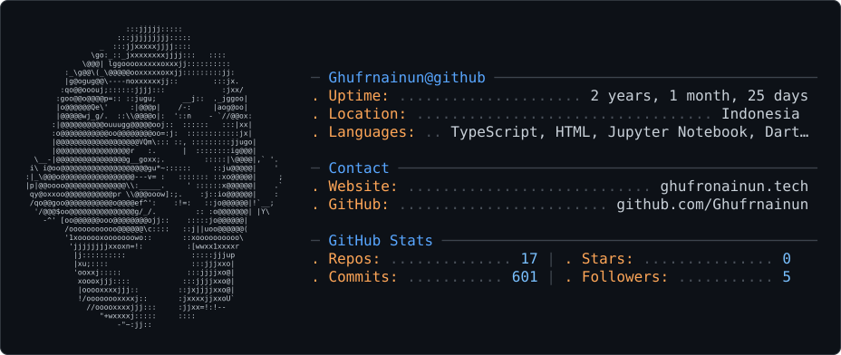

<picture>
  <source media="(prefers-color-scheme: dark)" srcset="dark_mode.svg">
  <source media="(prefers-color-scheme: light)" srcset="light_mode.svg">
  
</picture>

<h1 align="center">Ghufron Ainun Najib</h1>

  Full-stack developer and IT student building web, mobile, and applied AI products. 
  I turn practical problems into software people can use.

  <a href="https://ghufronainun.tech"><strong>Portfolio</strong></a> ·
  <a href="https://linkedin.com/in/ghufron-ainun-najib-a43b5b318">LinkedIn</a> ·
  <a href="https://x.com/Ghufrnajib">X</a> ·
  <a href="https://instagram.com/_ghfrn_an">Instagram</a> ·
  <a href="mailto:ghufronainunnajib@gmail.com">Email</a>

## About me

- IT student at Politeknik Negeri Semarang
- Building full-stack products with React, Next.js, Laravel, Flutter, Firebase, Supabase, and Convex
- Interested in applied AI, developer tools, automation, and self-hosted systems
- Learning in public through code, experiments, and technical writing

## Selected projects

<table>
  <tr>
    <td width="50%" valign="top">
      <h3><a href="https://github.com/sewainaja-pbl/sewainaja-mobile">SewainAja</a></h3>
      
Mobile rental marketplace that connects customers with local rental providers, from product discovery through booking.

      
<strong>Flutter · Express · Firebase · Cloudinary</strong>

      <a href="https://github.com/sewainaja-pbl/sewainaja-mobile">Source code</a>
    </td>
    <td width="50%" valign="top">
      <h3><a href="https://github.com/Ghufrnainun/NetraSense">NetraSense</a></h3>
      
Assistive computer-vision system that identifies Indonesian Rupiah banknotes and reads their value aloud.

      
<strong>Python · OpenCV · YOLO · PyTorch</strong>

      <a href="https://github.com/Ghufrnainun/NetraSense">Source code</a>
    </td>
  </tr>
  <tr>
    <td width="50%" valign="top">
      <h3><a href="https://github.com/Ghufrnainun/My-Porto-Guwe">Personal Portfolio</a></h3>
      
Editorial portfolio with project case studies, writing, dark mode, and a Supabase-backed content dashboard.

      
<strong>React · TypeScript · Supabase · Tailwind CSS</strong>

      <a href="https://ghufronainun.tech">Visit website</a>
    </td>
    <td width="50%" valign="top">
      <h3><a href="https://github.com/Ghufrnainun/Dashboard-Web-Map-Contour">Web Map Contour</a></h3>
      
Interactive dashboard for exploring map and contour data in a browser.

      
<strong>Web mapping · Data visualization</strong>

      <a href="https://github.com/Ghufrnainun/Dashboard-Web-Map-Contour">Source code</a>
    </td>
  </tr>
</table>

## Languages and tools

- **Languages:** JavaScript, TypeScript, PHP, Python, Dart, HTML, CSS, SQL
- **Frontend:** React, Next.js, Tailwind CSS
- **Backend & data:** Laravel, Node.js, Convex, Supabase, Firebase, PostgreSQL
- **Mobile & AI:** Flutter, OpenCV, PyTorch, YOLO
- **Workflow:** Git, GitHub, Linux, Docker, Figma, VS Code

  

## GitHub activity

<picture>
  <source media="(prefers-color-scheme: dark)" srcset="https://raw.githubusercontent.com/Ghufrnainun/Ghufrnainun/output/pacman-contribution-graph-dark.svg">
  <source media="(prefers-color-scheme: light)" srcset="https://raw.githubusercontent.com/Ghufrnainun/Ghufrnainun/output/pacman-contribution-graph.svg">
  
</picture>

  

<em>Open to internships, collaborations, and useful software projects.</em>

